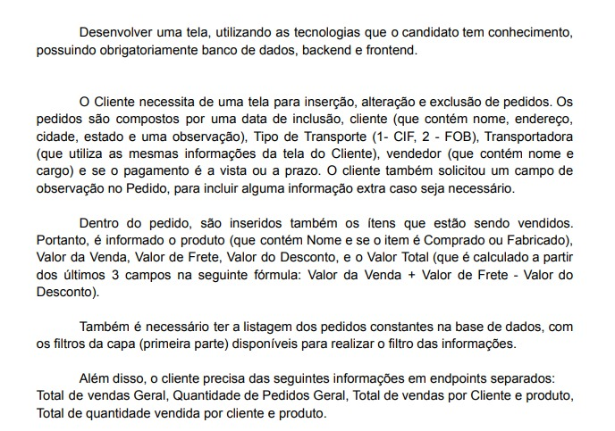
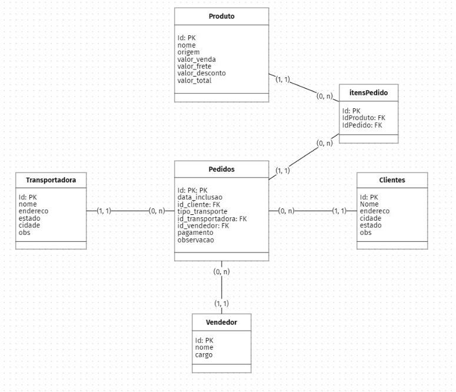

# Sistema de Pedidos

Esse é um sistema de pedidos, que foi desenvolvido a partir de um desafio que me foi proposto, que permite a realização das operações CRUD (Create, Read, Update, Delete) para transportadoras, clientes, pedidos e produtos.

## Desafio:

<div align = "center">
  
</div>

## Modelagem de dados:

A modelagem do banco de dados foi feita utilizando a ferramenta open source [BR Modelo Web](https://www.brmodeloweb.com/lang/pt-br/index.html)

<div align = "center">

</div>

## 💻 **Tecnologias Principais**

[](https://nodejs.org/)
[](https://developer.mozilla.org/pt-BR/docs/Web/JavaScript)


## **Tecnologias de Suporte**

Algumas tecnologias auxiliaram no desenvolvimento do projeto, dentre elas:


- [](https://sequelize.org/)
    - ORM (Object-Relational Mapping) para Node.js que simplifica a interação com bancos de dados SQL, proporcionando uma abstração poderosa e flexível.
- [](https://expressjs.com/)
  - Framework minimalista e flexível para Node.js, facilitando a construção de aplicativos web robustos e eficientes.
- [](https://www.npmjs.com/package/dotenv)
  - Biblioteca para carregar variáveis de ambiente de arquivos .env, auxiliando na configuração e segurança de projetos Node.js.


## Executando o Projeto Localmente

Para executar esse projeto certifique-se de ter o ambiente configurado com as seguintes ferramentas:
- [Node.js](https://nodejs.org/en)
- [MySQL](https://www.mysql.com/downloads/Building/)
- [GIT](https://git-scm.com/downloads)

1. **Importante**: É necessário seguir os passos abaixo tanto para o repositório do backend quanto para o repositório do frontend, respectivamente.


2. **Clone o Repositório**:

   - Copie o link do repositório no Github ([Backend](https://github.com/anaschwaab/sistema-pedidos-back) | [Frontend](https://github.com/anaschwaab/sistema-pedidos-front)).
   - Abra o terminal e navegue até a pasta onde você deseja clonar o projeto.
   - Execute o comando abaixo, substituindo `link` pelo link do repositório que você copiou:

     ```bash
     git clone link
     ```

3. **Acesse o Diretório do Projeto**:

   - Navegue para o diretório do projeto usando o terminal. Você pode fazer isso com o comando:

     ```bash
     cd nome-do-projeto
     ```

   Substitua `nome-do-projeto` pelo nome da pasta onde o projeto foi clonado.

4. **Instale as Dependências**:

   - Execute o seguinte comando para instalar as dependências do projeto:

     ```bash
     npm install
     ```

5. **Inicie o Aplicativo**:

   - Após a instalação das dependências, inicie o aplicativo no navegador com o seguinte comando:

     ```bash
     npm start
     ```

Isso iniciará o aplicativo localmente, e você poderá acessá-lo no navegador. Certifique-se de seguir essas etapas na ordem indicada para garantir que o projeto seja executado corretamente em sua máquina.